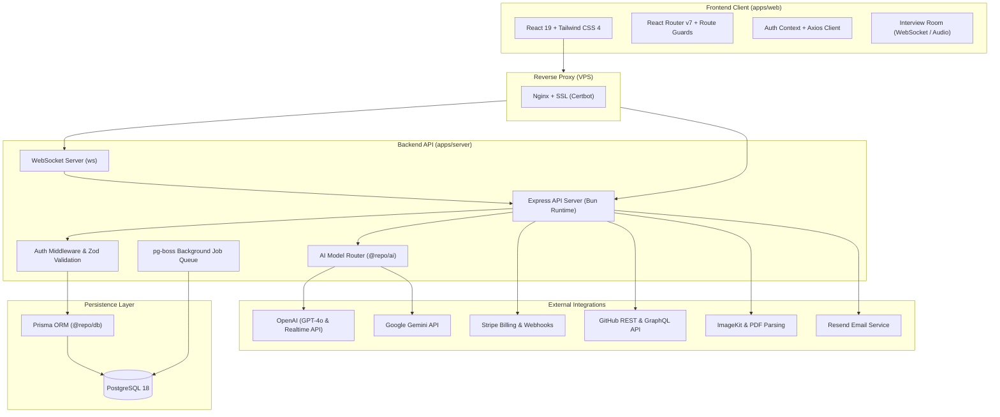
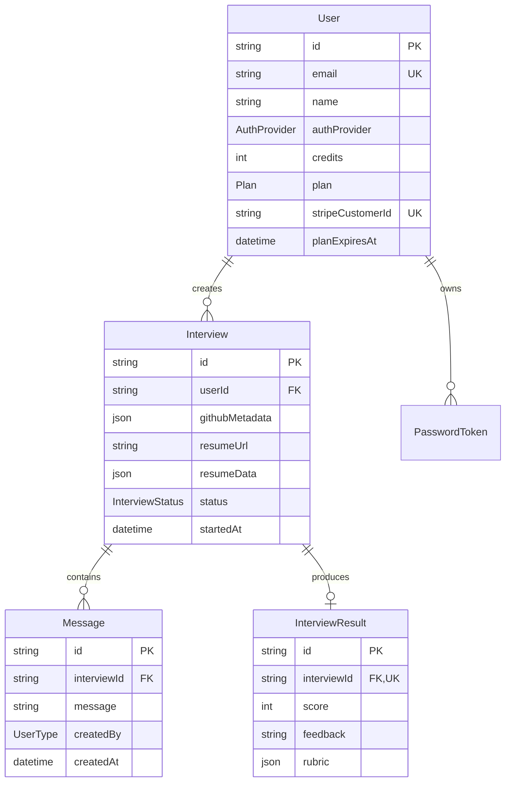
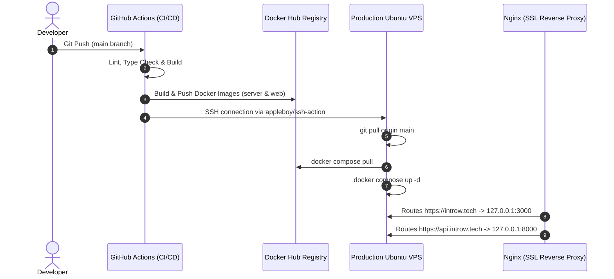

# 🎙️ Introw — AI-Powered Technical Interview & Candidate Assessment Platform

<div align="center">

[](https://www.typescriptlang.org/)
[](https://bun.sh/)
[](https://turbo.build/)
[](https://react.dev/)
[](https://www.docker.com/)
[](https://www.postgresql.org/)
[](https://www.prisma.io/)
[](https://stripe.com/)

**Next-generation technical mock interview platform that simulates realistic, dynamic interview conversations tailored to a candidate's GitHub repositories, code history, and resume.**

[Live Demo](https://introw.tech) • [API Endpoint](https://api.introw.tech) • [Architecture](#-system-architecture) • [Getting Started](#-getting-started) • [Deployment](#-devops--deployment)

</div>

---

## 🌟 Executive Summary

**Introw** is a full-stack, AI-native SaaS application designed to revolutionize technical interview preparation and automated candidate screening. Unlike static quiz tools, Introw leverages multimodal AI to:

1. **Ingest Real Candidate Context**: Deeply analyzes a candidate's actual GitHub repositories, commit patterns, language distributions, and uploaded PDF resumes.
2. **Conduct Real-Time Interactive Voice/Audio Interviews**: Simulates realistic conversational back-and-forth technical discussions with sub-second latency over WebSockets.
3. **Generate Actionable Evaluation Rubrics**: Produces structured feedback, detailed scoring breakdown across technical depth, communication, and problem-solving, with comprehensive improvement roadmaps.

Built on an enterprise-grade **Turborepo monorepo** powered by the ultra-fast **Bun runtime**, **React 19**, **Express**, and **PostgreSQL with Prisma**, Introw guarantees end-to-end type safety across client, server, and shared validation layers.

---

## ✨ Key Features

### 🤖 1. Context-Aware AI Interview Engine
- **GitHub Repository Analysis**: Automatically inspects public GitHub profiles and repositories to ask deep architectural and code-level questions about projects the candidate actually built.
- **Resume & Document Parsing**: Extracts work experience, skill trees, and projects from PDF resumes via ImageKit and `pdf-parse`.
- **Model Router (`@repo/ai`)**: Dynamic AI orchestration supporting **OpenAI (GPT-4o / Realtime)** and **Google Gemini** with structured output parsing and domain-specific prompt engineering.

### 🎙️ 2. Real-Time Interview Room
- **Interactive Audio & Text Streams**: Real-time bidirectional communication powered by WebSockets and OpenAI Realtime API sideband connections.
- **Live Transcript Capturing**: Automatically records turn-by-turn conversation between candidate and AI interviewer into persistent PostgreSQL storage.
- **Session State Management**: Tracks active calls, start times, completion statuses, and connection lifecycles.

### 📊 3. Deep Evaluation & Structured Feedback
- **Automated Score Generation**: Evaluates responses against an objective rubric covering technical proficiency, problem-solving ability, and clarity.
- **Detailed Feedback Cards**: Highlights specific strengths, critical gaps, and actionable recommendations.
- **Export & History**: Full historical archive of past interviews, scores, and downloadable transcripts.

### 💳 4. Billing, Subscriptions & Credit Quotas
- **Stripe Integration**: Supports subscription tiers (Free and Starter plans) with Stripe Checkout, Customer Portal, and webhook synchronization.
- **Credit-Based Usage**: Automatically validates and deducts interview credits with database transaction safety.

### 🔐 5. Robust Authentication & Security
- **Hybrid Authentication**: Secure password-based authentication with `bcryptjs` and one-click Google OAuth 2.0.
- **JWT Session Security**: Short-lived Access Tokens and HttpOnly Refresh Tokens with automatic token rotation and session refresh.
- **Transactional Emails**: Password reset links and transactional notifications powered by Resend.

---

## 🏛️ System Architecture



---

## 📦 Monorepo Structure

```text
introw/
├── apps/
│   ├── web/                    # React 19 Single Page App
│   │   ├── src/components/     # UI design system (Radix UI, Tailwind CSS 4, Lucide)
│   │   ├── src/contexts/       # Global state (Auth, Sessions)
│   │   ├── src/pages/          # Auth, Interview Room, Results, Billing, History
│   │   ├── src/services/       # Strongly-typed Axios API clients
│   │   └── build.ts            # Bun-native frontend bundler
│   │
│   └── server/                 # Express API Server (Bun Runtime)
│       ├── src/controller/     # Request handlers (Auth, Billing, Interviews)
│       ├── src/middlewares/    # JWT verification, CORS, error boundaries
│       ├── src/routes/         # Versioned REST endpoints (/api/v1/*)
│       ├── src/services/       # GitHub scraper, PDF parser, Email, Stripe
│       └── src/index.ts        # Server entrypoint & WebSocket listener
│
├── packages/
│   ├── ai/                     # AI abstraction layer (OpenAI & Gemini routers)
│   ├── common/                 # Shared TypeScript types, DTOs & Zod schemas
│   ├── db/                     # Prisma ORM schema, client generator & migrations
│   ├── eslint-config/          # Shared ESLint configuration
│   └── typescript-config/      # Shared tsconfig bases
│
├── docker/                     # Production multi-stage Dockerfiles (web & server)
├── .github/workflows/          # Automated GitHub Actions CI/CD pipelines
├── docker-compose.yaml         # Production Docker Compose stack
└── docker-compose.dev.yaml     # Local development Docker Compose stack
```

---

## 🗄️ Database Schema Overview



---

## 🛠️ Technology Stack

| Domain | Technologies & Libraries |
| :--- | :--- |
| **Runtime & Monorepo** | [Bun](https://bun.sh/) (v1.2+), [Turborepo](https://turbo.build/) |
| **Frontend UI** | [React 19](https://react.dev/), [React Router v7](https://reactrouter.com/), [Tailwind CSS v4](https://tailwindcss.com/), [Radix UI](https://www.radix-ui.com/), [Lucide Icons](https://lucide.dev/) |
| **Backend API** | [Express 5](https://expressjs.com/), [WebSockets (ws)](https://github.com/websockets/ws), [pg-boss](https://github.com/timgit/pg-boss) |
| **Database & ORM** | [PostgreSQL 18](https://www.postgresql.org/), [Prisma ORM](https://www.prisma.io/) |
| **Validation & Types** | [Zod](https://zod.dev/), [TypeScript 5.9](https://www.typescriptlang.org/) |
| **AI & LLM Services** | [OpenAI Realtime API & GPT-4o](https://openai.com/), [Google Gemini](https://ai.google.dev/) |
| **Third-Party APIs** | [Stripe](https://stripe.com/) (Payments), [Resend](https://resend.com/) (Emails), [ImageKit](https://imagekit.io/) (Assets/PDFs), [GitHub API](https://docs.github.com/en/rest) |
| **DevOps & Infrastructure** | [Docker](https://www.docker.com/), [Docker Hub](https://hub.docker.com/), [Nginx](https://nginx.org/), [Certbot (SSL)](https://certbot.eff.org/), [GitHub Actions](https://github.com/features/actions) |

---

## 🚀 Getting Started

### Prerequisites
- [Bun](https://bun.sh/) >= 1.2.21
- [Docker](https://www.docker.com/) & Docker Compose
- Node.js >= 18 (optional, for compatibility)

### 1. Clone the Repository
```bash
git clone https://github.com/abhradeepbarman/introw.git
cd introw
```

### 2. Install Dependencies
```bash
bun install
```

### 3. Environment Configuration
Copy the sample environment file and configure your API keys:
```bash
cp .env.example .env
```

| Variable | Description |
| :--- | :--- |
| `POSTGRES_USER` / `POSTGRES_PASSWORD` / `POSTGRES_DB` | PostgreSQL credentials |
| `PORT` | Express backend port (default: `8000`) |
| `WEB_PORT` | React frontend port (default: `3000`) |
| `APP_URL` | Frontend public URL (e.g. `http://localhost:3000`) |
| `BUN_PUBLIC_API_BASE_URL` | Backend public URL (e.g. `http://localhost:8000`) |
| `ACCESS_SECRET` / `REFRESH_SECRET` | JWT signing secrets |
| `OPENAI_API_KEY` / `GEMINI_API_KEY` | LLM Provider API keys |
| `STRIPE_SECRET_KEY` / `STRIPE_WEBHOOK_SECRET` | Stripe credentials |
| `RESEND_API_KEY` | Transactional email API key |
| `IMAGEKIT_PRIVATE_KEY` | Document upload private key |
| `GH_TOKEN` | GitHub Personal Access Token for profile ingestion |

### 4. Database Setup
Start local PostgreSQL and run database migrations:
```bash
# Start Postgres in Docker
docker compose -f docker-compose.dev.yaml up -d postgres

# Push schema to database
cd packages/db && bun run db:push && cd ../..
```

### 5. Start Development Server
```bash
bun run dev
```
- **Web Application**: `http://localhost:3000`
- **Backend API**: `http://localhost:8000`

---

## 🚢 DevOps & Deployment

Introw is built for fully automated, zero-downtime continuous integration and continuous deployment (CI/CD):



1. **Continuous Integration**: On every commit, GitHub Actions executes type checking (`tsc --noEmit`), linting (`eslint`), and multi-stage container builds.
2. **Container Registry**: Images (`introw-web` and `introw-server`) are tagged with `latest` and `${{ github.sha }}` and published to Docker Hub with GitHub Actions Layer Caching.
3. **Automated Deployment**: GitHub Actions connects via SSH to the production VPS, pulls updated configurations, fetches new Docker layers, and performs rolling updates without downtime.
4. **Edge Security**: Managed via Nginx reverse proxy with automated TLS/SSL renewals through Let's Encrypt / Certbot.

---

## 🔒 Security Best Practices Implemented

- **No Plaintext Passwords**: Hashed with salt rounds using `bcryptjs`.
- **Stateless Authentication with Sliding Refresh**: Refresh tokens securely stored in `HttpOnly`, `SameSite=Strict`, `Secure` cookies.
- **Input Validation**: 100% of user inputs sanitized and validated at compile and runtime using `Zod` schemas.
- **CORS & Rate Protection**: Explicit origin whitelist with pre-flight handling and reverse proxy header forwarding.
- **Isolated Docker Network**: Internal Postgres database is inaccessible to public traffic and binds strictly to the internal Docker network.

---

## 📄 License

This project is licensed under the [MIT License](LICENSE).

<div align="center">

Made with ❤️ by [Abhradeep Barman](https://github.com/abhradeepbarman)

</div>
